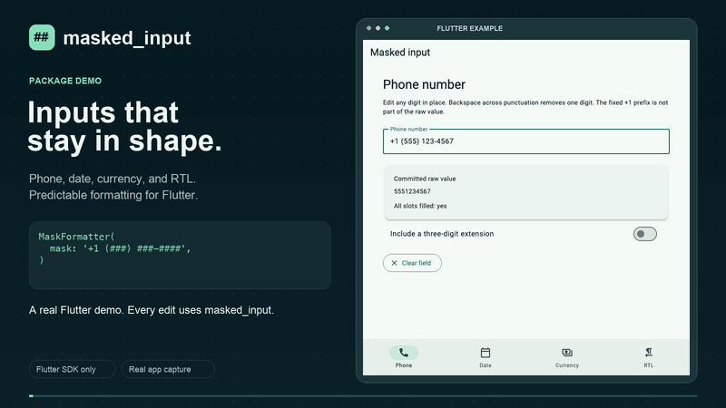

# masked_input

Slot-based input masks for Flutter, with predictable cursor behavior, Unicode
letters, dynamic masks, and minor-unit currency formatting. The only declared
runtime dependency is the Flutter SDK. No native code, I/O, or analytics.

This is a local **0.1.0 implementation**, not a published 1.0 release. Physical
keyboard/IME and accessibility release checks are tracked in
[the release checklist](doc/RELEASE_CHECKLIST.md).

## Demo

[](doc/media/masked-input-demo.mp4)

[Watch the full 36-second video](doc/media/masked-input-demo.mp4) · [Static preview](doc/media/demo-poster.png)

See phone formatting, dynamic masks, mid-text edits, backspace across literals,
lazy/eager separators, currency, and RTL input. The animated preview is sped up;
the captioned MP4 plays at normal demo speed. No audio is required.

## Quick start

Until published, add a path dependency from your app:

```yaml
dependencies:
  masked_input:
    path: ../masked_input
```

```dart
import 'package:flutter/material.dart';
import 'package:masked_input/masked_input.dart';

final phoneMask = MaskFormatter(mask: '+1 (###) ###-####');

TextField(
  inputFormatters: [phoneMask],
  keyboardType: TextInputType.phone,
);

// After entering 5551234567:
phoneMask.maskedText;   // +1 (555) 123-4567
phoneMask.unmaskedText; // 5551234567 (the literal +1 is excluded)
phoneMask.isComplete;   // true
```

Create formatters once in your widget state, **one instance per field**. Recreating
them during `build` loses positional holes. Sharing an instance across fields is
unsupported.

## Syntax

| Token | Accepted input |
| --- | --- |
| `#` | One ASCII digit, `0` through `9` |
| `A` | One Unicode letter, including non-Latin scripts |
| `N` | One Unicode letter or ASCII digit |
| `*` | One Unicode scalar except CR, LF, U+2028, U+2029 |
| `\x` | Literal `x`, including escaped placeholders and backslash |
| Any other character | A fixed literal |

```dart
final serial = MaskFormatter(
  mask: 'HHHH-HHHH',
  filter: {'H': RegExp(r'[0-9A-Fa-f]')},
);
final escaped = MaskFormatter(mask: r'\# ###'); // literal # then three digits
```

Custom filters merge over the defaults and must match the **entire scalar**.
Keys must be one scalar, excluding backslash; unused valid keys are ignored.
An empty mask or trailing escape throws `MaskSyntaxError`. Invalid characters are
skipped during paste and rejected during typing. Input is never case-folded,
normalized, or digit-shaped. `isComplete` checks filled slots, not whether a date,
card number, or identifier is valid. Literal-only masks have no input slots and
are structurally complete; they display an empty string.

## Editing model

Typing into a filled slot **replaces** it. Backspace removes the nearest filled
slot to the left; forward delete removes the nearest filled slot on the right.
Literals are regenerated and cannot be removed as user data. A selection clears
intersecting slots before replacement. Paste skips invalid characters and stops
when the mask is full. Formatted paste recognizes literal runs at their expected
positions, including digit-containing prefixes.

Slots never shift during ordinary edits. Deleting the `3` from `123-45` leaves
`12-45`; inserting `9` at that hole restores `129-45`. Holes are invisible but
remain in the formatter's canonical state. Plain text alone cannot reconstruct
all holes; use the same formatter instance throughout a field's lifetime.

After insertion, the caret advances to the next slot, skipping rendered literals.
For `##/##/####`, replacing the second digit in `25/09/2026` puts the caret at
UTF-16 offset 3 (after `/`). Deliberate cursor/selection movement is preserved,
except offsets inside surrogate pairs are snapped to a scalar boundary.

Lazy completion (default) displays `12` for input `12` with mask `##/##`. Eager
completion displays `12/`:

```dart
final date = MaskFormatter(
  mask: '##/##/####',
  type: MaskAutoCompletionType.eager,
);
```

## Controller updates

A formatter does not own or observe a controller. Assign returned values:

```dart
controller.value = phoneMask.clear();
controller.value = phoneMask.updateMask(mask: '#### ###### #####');
```

`clear()` resets all committed state. `updateMask()` compacts and reapplies current
raw input, discards invalid/overflow input, and maps the caret to the same slot or
the new end. Omitted filter/mode arguments retain current settings; `filter: {}`
restores built-ins. Invalid syntax leaves the previous state intact. Update masks
only after an active IME composition commits.

Directly setting `controller.text` bypasses Flutter input formatters. On the next
edit, the formatter best-effort imports that text, recognizing expected literals.
To start with a value, use `initialText`, then initialize your controller with
`TextEditingController.fromValue(formatter.value)`.

Stateless helpers do not alter any formatter:

```dart
maskText('25092026', mask: '##/##/####');       // 25/09/2026
unmaskText('25/09/2026', mask: '##/##/####');   // 25092026
```

`maskText` always interprets raw input. `unmaskText` and `initialText` interpret
formatted input with raw-input tolerance. When literals themselves match slot
filters, input is inherently ambiguous; use `MaskEngine.apply` for explicitly raw
values. The pure `MaskDefinition` and `MaskEngine` implementation has no Flutter
imports. The package as a whole requires Flutter.

## Currency

```dart
final price = CurrencyFormatter(locale: 'en_US', symbol: r'$', decimalDigits: 2);
// Enter 125000 -> $1,250.00
// price.unmaskedText == '125000'
// Backspace -> $125.00
```

Currency uses a stream of **minor-unit ASCII digits**, never floating-point
arithmetic. Decimal punctuation in pasted input is decoration; this is not a
locale-aware number parser. Pasting `12.3` means 123 minor units (`$1.23`), not
`$12.30`. Signs and non-ASCII digits are ignored. Signed amount entry is not
supported. Raw leading zeros are preserved; zeros added solely for display are
excluded from `unmaskedText`. An empty field stays empty.

Supported defaults: `en_US`, `en_GB`, `en_CA`, `en_AU`, `de_DE`, `fr_FR`, `pt_BR`,
`ja_JP`, `hi_IN`, `ar_EG`. Hyphenated tags such as `en-US` are accepted. Japanese
defaults use zero fraction digits; Indian grouping uses `12,34,567.89`. Unsupported
locales throw `ArgumentError`. `CurrencyLocale.supported` exposes the complete
convention table; it is intentionally small and is not a CLDR implementation.

Override `symbol`, `decimalDigits` (0 through 20), `groupSeparator`,
`decimalSeparator`, `symbolOnLeft`, and `symbolSeparator` as needed. Set `symbol`
or `groupSeparator` to `''` to omit it. Currency edits insert/remove raw digits
and map the caret through grouping changes. Each instance belongs to one field.

## Unicode, IME, and RTL

Atomic units are Unicode **scalars (runes)**. A supplementary-plane emoji in `*`
occupies one slot and is never split into UTF-16 halves. Extended grapheme clusters
(combining marks, flags, ZWJ family emoji) can occupy multiple slots and the cursor
may rest between their scalars. `A` accepts letters, not emoji or combining marks.
`#` intentionally rejects Arabic-Indic digits; opt in with a custom Unicode digit
filter if your backend accepts them.

Active IME composing values pass through **completely unchanged**. Accessors keep
the last committed value; the final committed edit is applied against the saved
pre-composition value. This follows Flutter's
[TextInputFormatter contract](https://api.flutter.dev/flutter/services/TextInputFormatter-class.html)
and avoids moving an IME-owned composing region.

For RTL, use the same direction on the formatter and field:

```dart
final id = MaskFormatter(mask: '###-###-####', textDirection: TextDirection.rtl);
TextField(inputFormatters: [id], textDirection: id.textDirection);
```

Direction is explicit metadata; input and mask remain in logical order. Flutter's
bidi rendering controls visual order. This does not reverse the mask or fill from
the right. Applications should test their actual keyboards and screen readers.

## Development

Declared minimum: Dart 3.6 / Flutter 3.27. See [verification](doc/VERIFICATION.md)
for SDK versions actually exercised. Run:

```sh
flutter pub get
flutter analyze
flutter test --coverage
cd example
flutter pub get
flutter test
flutter run -d chrome
```

The example has Phone, Date, Currency, and RTL screens, live raw values, clear,
and dynamic-mask controls. Generated host projects cover Android, iOS, web,
macOS, Windows, and Linux. Presence of a host project is not device certification.

See [migration](doc/MIGRATION.md), [spec decisions](doc/SPEC_DECISIONS.md), and
[contributing](CONTRIBUTING.md). No competitor compatibility, pub score, or device
performance is claimed without measured evidence.
